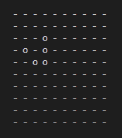
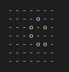

[](https://classroom.github.com/open-in-codespaces?assignment_repo_id=10312268)
PHAS0100ASSIGNMENT1
------------------

Purpose
-------

This project serves as a starting point for the PHAS0100 2022/23 Assignment 1 Game of Life Simulation coursework. It has a reasonable folder structure for [CMake](https://cmake.org/) based projects that use [CTest](https://cmake.org/) to run unit tests via [Catch](https://github.com/catchorg/Catch2). 

Further information on the specific project is left as an exercise for the student.

Credits
-------

This project is maintained by [Dr. Jamie Quinn](http://jamiejquinn.com/). It is based on [CMakeCatch2](https://github.com/UCL/CMakeCatch2.git) that was originally developed as a teaching aid for UCL's ["Research Computing with C++"](https://github-pages.ucl.ac.uk/research-computing-with-cpp/) course developed by [Dr. James Hetherington](http://www.ucl.ac.uk/research-it-services/people/james) and [Dr. Matt Clarkson](https://iris.ucl.ac.uk/iris/browse/profile?upi=MJCLA42).

Build Instructions
------------------

To run cmake:

```
cmake -B build
```

To compile:

```
cmake --build build
```

To test:

```
cd build
ctest
```

Command-line application Instructions
------------------

To get help message, please use the code below:
```
cd build
./bin/golSimulator -h
```

This application allows us to input file (.txt) with specific evolutions:

```
cd build
./bin/golSimulator file_input file_path -n evolutions
```

For example, if you want this application run with glider.txt with 4 evolutions:
```
cd build
./bin/golSimulator file_input ../test/data/glider.txt -n 4
```
Then you will get the output like this screenshot:



Furthermore, this application can also generate random grid if we input rows, columns, number of alive cells and number of evolutions:

```
cd build
./bin/golSimulator random_initial -s rows columns alive_cells_number -n evolutions
```

Here is an example for the above code with output, which evaluates an 7x7 grid with 15 alive cells 4 times:

```
cd build
./bin/golSimulator random_initial -s 7 7 15 -n 4
```



Finally, it can find stationary patterns.